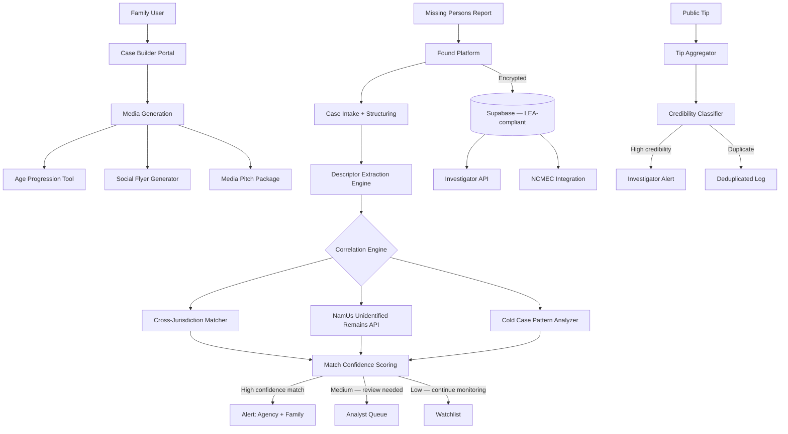

<p align="center">
  <h1 align="center">foundation-found</h1>
  <h3 align="center"><em>Missing persons & cold case intelligence. Cross-jurisdiction correlation. 600K reports/year.</em></h3>
</p>

<p align="center">
  <a href="LICENSE"></a>
  
  
  <a href="https://mama.oliwoods.ai"></a>
  <a href="https://mama.oliwoods.ai/foundation"></a>
</p>

---

> **"Over 600,000 people are reported missing in the United States every year. At any given moment, roughly 89,000 active cases remain open — many never investigated beyond the first 48 hours."**
> — NCMEC & FBI National Crime Information Center, 2023
>
> *Most missing persons cases cross county lines within days. Most jurisdictions have no way to share data in real time. We built the correlation layer that never existed.*

## Why This Exists

- **Jurisdiction fragmentation is lethal.** The United States has 18,000+ independent law enforcement agencies. There is no federal requirement for real-time data sharing on missing persons cases. A victim can cross county lines and disappear from the investigative record ([DOJ Report on Missing Persons, 2022](https://www.ojp.gov/))
- **Unidentified remains go uncorrelated.** The FBI's NamUs database contains 14,000+ unidentified human remains cases. An estimated 4,400 of them have matching missing persons reports in other jurisdictions — but the connection has never been made ([NamUs, 2023](https://namus.nij.ojp.gov/))
- **Cold cases receive no resources.** After 30 days, most missing persons cases receive zero active investigative hours unless a family hires a private investigator. Families are left to build their own case files with no tools and no access to records ([NCMEC, 2023](https://www.missingkids.org/))
- **Racial disparity in coverage is documented.** Black, Indigenous, and people of color who go missing receive disproportionately less media coverage, fewer investigative resources, and lower rates of successful resolution ([Crenshaw et al., 2022, Missing White Woman Syndrome study](https://aapf.org/))

## What Found Does

| Capability | Description |
|---|---|
| **Cross-Jurisdiction Case Correlator** | Matches active missing persons reports across state and county lines using shared descriptors, geography, and timeline overlap |
| **Unidentified Remains Matcher** | Correlates NamUs unidentified remains records with active missing persons cases using probabilistic matching |
| **Cold Case Intelligence Engine** | Surfaces overlooked patterns in cold case data: geographic clustering, behavioral profiles, timeline anomalies |
| **Family Case Builder** | Guided intake for families to document information, upload media, and build structured case files |
| **Media Amplification Tool** | Generates age-progressed images, social media flyers, and media pitch packages |
| **Investigator API** | Secure API for law enforcement and licensed investigators to query correlation data |
| **Volunteer Tip Aggregator** | Structured public tip intake with AI-assisted credibility scoring and duplicate detection |
| **DNA & Records Request Guide** | Step-by-step guidance for families navigating FOIA requests, DNA submission, and record access |

## System Architecture



## Why This Is the Best Tool on the Market

Private investigators charge families $150–$300/hr for work that should be automated. NCMEC and NamUs are powerful databases but require manual cross-referencing. No open-source tool provides real-time cross-jurisdiction correlation, unidentified remains matching, and family-facing case tools in a single platform.

**We built this for the families who wait years for a phone call. And for the investigators who never had the tools to make that call sooner.**

### vs. Commercial Alternatives

| Feature | foundation-found | Commercial Alt. |
|---------|---------|-----------------|
| Price | **Free forever** | $150–300/hr (PI) |
| Cross-Jurisdiction Correlation | **Yes** | Manual only |
| NamUs Unidentified Matching | **Yes** | Manual API query |
| Cold Case Pattern Analysis | **Yes** | No |
| Family Case Builder | **Yes** | No |
| Age Progression | **Yes** | $500+/image |
| Open Source | **Yes** | No |

## Research & Citations

- NCMEC (2023). *Missing Children Statistics*. [missingkids.org](https://www.missingkids.org/footer/media/keyfacts)
- NamUs (2023). *National Missing and Unidentified Persons System*. [namus.nij.ojp.gov](https://namus.nij.ojp.gov/)
- FBI NCIC (2023). *Missing Person Files — Annual Report*. [fbi.gov/services/cjis/ncic](https://www.fbi.gov/services/cjis/ncic)
- DOJ Office of Justice Programs (2022). *Research on Missing Persons*. [ojp.gov](https://www.ojp.gov/)
- Crenshaw, K. et al. / African American Policy Forum (2022). *#SayHerName: Racial Disparities in Missing Persons Coverage*. [aapf.org](https://aapf.org/)

## Quick Start

```bash
git clone https://github.com/OliWoods-Org/foundation-found.git
cd foundation-found
npm install
npm run dev
```

## Tech Stack

- **Runtime:** Node.js + TypeScript
- **Validation:** Zod schemas
- **Database:** Supabase (PostgreSQL, law enforcement access controls)
- **AI:** Claude API + facial aging models + NLP case correlation
- **Integrations:** NamUs API, NCMEC, FBI NCIC (read-only)
- **Alerts:** Twilio (SMS/WhatsApp), Resend (email)

## Contributing

We welcome contributions from law enforcement technologists, data scientists, and missing persons advocates.

1. Fork the repo
2. Create a feature branch (`git checkout -b feat/your-feature`)
3. Commit your changes
4. Push and open a PR

## License

AGPL-3.0 — Free to use, modify, and distribute.

---

<p align="center">
  <strong>Built by the <a href="https://oliwoods.ai">OliWoods Foundation</a></strong><br>
  <em>Free forever. Open source. Because everyone deserves to be found.</em>
</p>
